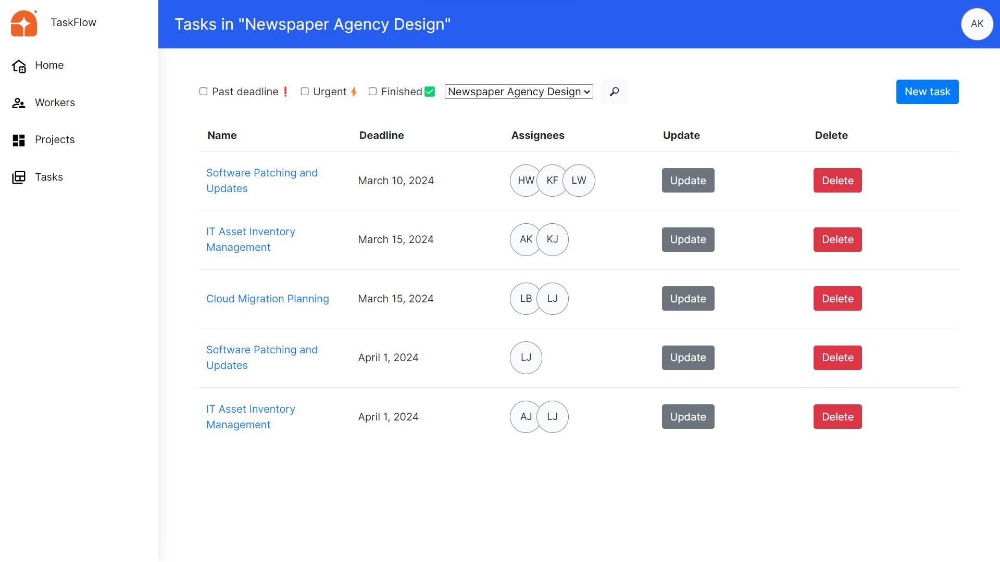

# TaskFlow Manager

Web application IT company task manager which allows to track task, deadlines, assignees and projects

## Installing / Getting started

Python3 must be already installed

```shell
git clone https://github.com/kabust/TaskFlow-Web-App.git
cd TaskFlow-Web-App
python3 -m venv venv
pip install -r requirements.txt
python manage.py runserver
```

After running that code you'll be able to browse the website locally on your computer

### Features

* Authentication functionality for Worker/User
* Managing tasks and projects from the presented interface
* Following tasks deadlines and assignees
* Filtering and searching
* Admin panel for advanced DB management

## Demo
